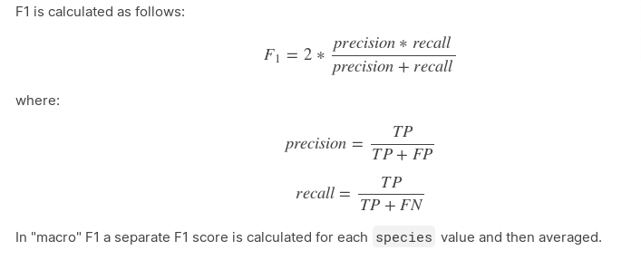
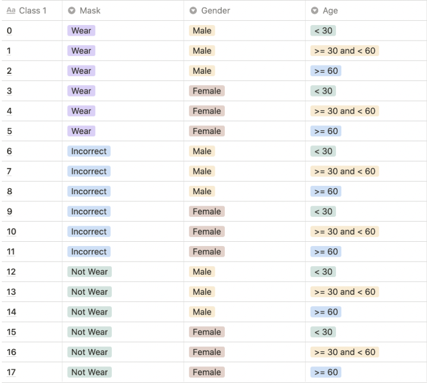

# pstage_01_image_classification


## Getting Started   

### Dependencies
```python
torch==1.6.0
torchvision==0.7.0
tensorboard==2.4.1
pandas==1.1.5
opencv-python==4.5.1.48
scikit-learn==0.24.1
matplotlib==3.2.1
efficientnet_pytorch==0.7.1
timm==0.5.4                                                         
```
  
### Install Requirements
- `pip install -r requirements.txt`
  
### Contents  
- `dataset.py`
- `evaluation.py`
- `infer_sch.py` : using scheduling
- `inference-ensemble.py`
- `inference.py`
- `inference_custom.py`
- `label_corrections.py`
- `loss.py`
- `model.py`
- `requirements.txt`
- `train.py`
- `train_custom.py`
- `train_sch.py` : using scheduling
- `utils.py`
- `validation.py`
- `validation_custom.py`
 
### Training
- `python train.py --config ./configs/model_config.json`

### Inference
- `python inference.py --config ./configs/model_cnofig.json`

### Evaluation
- `SM_GROUND_TRUTH_DIR=[GT dir] SM_OUTPUT_DATA_DIR=[inference output dir] python evaluation.py`  

## Overview
### Background
> COVID-19의 확산으로 우리나라는 물론 전 세계 사람들은 경제적, 생산적인 활동에 많은 제약을 받고있습니다. </br>
> 확산을 막기위해 많은 노력들을 하고 있지만 COVID-19의 강한 전염력 때문에 우리를 오랫동안 괴롭히고 있습니다. </br>
> 이를 해결하는 방법은 모든 사람이 마스크로 코와 입을 가려서 혹시 모를 감염자로부터의 전파 경로를 원천 차단하는 것입니다. </br>
> 이를 위해 우리는 공공장소에서 모든 사람들의 올바른 마스크 착용 상태를 검사하는 시스템이 필요합니다. </br>
> 즉, **카메라로 비춰진 사람 얼굴 이미지만으로 이 사람이 마스크를 쓰고 있는지, 쓰지 않았는지, </br>
> 정확히 쓴 것이 맞는지 자동으로 가려낼 수 있는 시스템이 필요합니다.**
  
### Problem definition
> 카메라로 비춰진 사람 얼굴 이미지만으로 이 사람이 마스크를 쓰고 있는지, </br>
> 쓰지 않았는지, 정확히 쓴 것이 맞는지 자동으로 가려낼 수 있는 시스템 or 모델
  
### Development environment
- GPU V100 원격 서버
- PyCharm 또는 Visual Studio Code | Python 3.7(or over)

### Evaluation


## Dataset   
  

- 전체 사람 수 : 4500명 (train : 2700 | eval : 1800)
- age : 20대 - 70대
- gender : 남,여
- mask : 개인별 정상 착용 5장, 비정상적 착용 1장(코스크,턱스크...), 미착용 1장
- 전체 31,500 Images (train : 18,900 | eval : 12,600)
- 이미지 크기 : (384,512)

### Data Labeling
- mask, gender, age 기준 18개의 클래스로 분류


### Pre-trainied Models  
- [Efficientnet](https://arxiv.org/abs/1905.11946)
- [CoAtNet](https://arxiv.org/abs/2106.04803)
- [Coral-CNN](https://arxiv.org/abs/1901.07884)

### Best Model & Hyperparameters  
### [Resnet50](https://arxiv.org/abs/1512.03385)
    * Parameters : ./configs/best_model_config.json

```zsh
$ python train.py ./configs/best_model_config.json
$ python inference.py ./configs/best_model_config.json
```  
